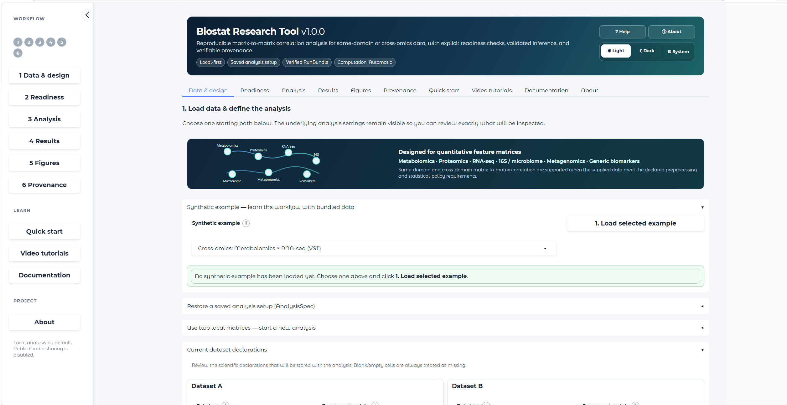

# Biostat Research Tool — v1.0.0

Biostat Research Tool is a local-first, reproducible biostatistics application for biomedical and multi-omics research. The first validated module performs matrix-to-matrix Pearson or Spearman correlation for same-domain or cross-omics data with omics-aware input guardrails, exact sample alignment, pairwise-N tracking, global Benjamini-Hochberg adjustment, a versioned AnalysisSpec, and a verified RunBundle.

This is the **v1.0.0 public release**. The statistical oracle and accepted performance backends are frozen for this release, and the browser/CLI workflow has completed release-candidate validation.

## Guided browser workflow

The browser now uses a compact **research-workstation layout** with a persistent left workflow rail: **1 Data & design → 2 Readiness → 3 Analysis → 4 Results → 5 Figures → 6 Provenance**. Technical controls include contextual-help triggers available by mouse hover, keyboard focus/Enter, and tap/click, so the interface does not depend on hover alone.

Separate **Learn** surfaces provide Quick start, Video tutorials, and Documentation, while **About** records scope, privacy, validation language, citation, and license. Project-specific YouTube tutorial slots are included but remain link-free until project videos are actually published.

After a synthetic example is loaded, the UI displays an explicit checked loaded state. The Figures workspace uses a compact controls column beside a larger plotting stage and explains where to download PNG, SVG, PDF, and batch association-report outputs.

## What is included

- Local browser interface and first-class CLI using one shared runner.
- Supported profiles: metabolomics, RNA-seq, metagenomics, 16S/amplicon microbiome, proteomics, and generic quantitative matrices.
- Pearson or Spearman, one prespecified method per run.
- Exact/Monte Carlo/asymptotic Spearman inference policy from the independently accepted v0.2.4 oracle.
- Pairwise complete-case N for every feature pair.
- One global Benjamini-Hochberg family over all eligible A×B pairs.
- Study-design guardrail: ordinary inference currently requires independent observations.
- RNA-seq and microbiome preprocessing guardrails.
- Versioned AnalysisSpec and integrity-checked RunBundle.
- Accepted optimized Pearson and complete-data Spearman backends with transparent fallback to the frozen scalar reference.
- Deterministic synthetic examples and intentionally blocked guardrail examples.

## Interface



## Install

**Biostat Research Tool** is tested with **Python 3.13**.

### Recommended: install from the release wheel

Download `biostat_research_tool-1.0.0-py3-none-any.whl` from the GitHub release, then install it in a virtual environment.

**Windows PowerShell**

```powershell
py -3.13 -m venv .venv
.\.venv\Scripts\Activate.ps1
python -m pip install --upgrade pip
python -m pip install biostat_research_tool-1.0.0-py3-none-any.whl
```

**macOS / Linux**

```bash
python3.13 -m venv .venv
source .venv/bin/activate
python -m pip install --upgrade pip
python -m pip install biostat_research_tool-1.0.0-py3-none-any.whl
```

Confirm the installation:

```bash
biostat --version
```

Expected output:

```text
biostat 1.0.0
```

Launch the local web interface:

```bash
biostat serve
```

The application runs locally. Open the local address printed in the terminal in your web browser.

### Install from source

Clone the repository and install it into a virtual environment:

```bash
git clone https://github.com/dimuthu-perera/biostat-multiomics.git
cd biostat-multiomics
python -m pip install .
```

Then verify and launch:

```bash
biostat --version
biostat serve
```

## Browser workflow

```text
Load synthetic example or upload data
        ↓
Declare omics type / preprocessing / study design
        ↓
Data-readiness inspection
        ↓
Review warnings and alignment
        ↓
Run Pearson or Spearman
        ↓
Inspect results
        ↓
Download verified RunBundle
```

The browser binds to `127.0.0.1`, public Gradio sharing is disabled, and Gradio analytics are disabled by default.

Normal browser execution uses **automatic computation-engine selection**: an accepted optimized path is used when eligible and the frozen reference engine is used otherwise. This execution choice does not change the requested statistical method or AnalysisSpec. Exact requested/actual backend identifiers and any fallback reason remain recorded in the RunBundle.

## CLI

```bash
biostat inspect data.csv --orientation samples_rows --data-type metabolomics --preprocessing quantitative
biostat validate analysis.json
biostat run analysis.json --acknowledge-warnings
biostat verify runs/<run-directory>
biostat report runs/<run-directory>
biostat serve
```

The CLI default backend is `auto`. Explicit audit/reproducibility execution remains available:

```bash
biostat run analysis.json --backend reference --acknowledge-warnings
biostat run analysis.json --backend optimized --verify-against-reference --acknowledge-warnings
```

The Python API retains its historical `reference` default unless a backend is explicitly requested.

## Synthetic example library

The installed package contains deterministic synthetic examples for all supported profiles and same-domain and cross-omics workflows. The browser example library includes same-domain metabolomics, RNA-seq, and proteomics demonstrations as well as cross-omics workflows. The library also includes blocked examples such as raw RNA-seq counts and relative-abundance microbiome data so users can see the guardrails in action.

All bundled examples are completely synthetic and are not derived from real participants. They are designed to demonstrate software behavior, not to reproduce the full biological distribution of an assay.

Regenerate them with:

```bash
python scripts/generate_synthetic_examples.py
```

## Statistical scope

Current correlation results are **unadjusted marginal associations**. The module does not currently adjust for age, sex, batch, disease group, medication, ancestry, or other covariates, and it does not claim causation, regulation, mediation, prediction, diagnosis, or treatment effect.

RNA-seq raw counts, TPM, FPKM, untransformed CPM, and normalized-but-untransformed counts are blocked from this generic correlation workflow. Microbiome raw/normalized counts and relative abundance are blocked; documented CLR or other compositionally appropriate transformed coordinates may proceed with interpretation warnings.

No automatic imputation, normalization, log transformation, scaling, batch correction, or outlier removal is performed.

See [`docs/METHODS.md`](docs/METHODS.md) and [`docs/STATISTICAL_POLICY_V1.md`](docs/STATISTICAL_POLICY_V1.md) for the full statistical contract and limitations.

## Reproducibility

Each completed analysis records, among other fields:

- canonical requested/effective AnalysisSpec;
- SHA-256 identities of analyzed input bytes;
- exact sample alignment;
- inspection findings and warning acknowledgement;
- pairwise N and hypothesis-family metadata;
- statistical algorithm/oracle version;
- requested and actual execution backend;
- software versions and provenance;
- result schema, CSV results, HTML report, and integrity inventory.

`biostat verify` validates bundle structure, hashes, and semantic consistency for current correlation bundles.

When an AnalysisSpec is restored in the browser, the recorded Dataset A/B SHA-256 values remain active as expected identities while the researcher re-selects local source files. Byte-identical relocated or renamed files are accepted; changed bytes are blocked during inspection. **Start new request** explicitly clears that restored identity when a different dataset is intentional.

## Privacy

Source research matrices are not copied into RunBundles, but RunBundles can contain sample identifiers, feature identifiers, alignment information, statistical results, and study metadata. Treat them according to the sensitivity of those identifiers and results.

Browser temporary artifacts are local. By default, Biostat uses a private process-owned Gradio cache; generated AnalysisSpec/RunBundle downloads are session-tracked and removed on invalidation/new inspection, and the private cache is removed on normal process exit. Abnormal termination cannot guarantee cleanup, and operators who override `GRADIO_TEMP_DIR` own that cache lifecycle. See [`docs/PRIVACY.md`](docs/PRIVACY.md).

## Validated implementation boundaries

- v0.2.4 scalar correlation oracle: independently accepted and hash-frozen.
- v0.3.5 AnalysisModule/provenance boundary: independently accepted.
- v0.4.0 complete-data Pearson optimization: independently accepted.
- v0.4.1 reusable-mask pairwise-missing Pearson optimization: independently accepted.
- v0.4.2 complete-data Spearman pre-ranking optimization: independently accepted.

Spearman with missingness and highly fragmented/unsupported numerical cases continue through the frozen reference engine.

## Dependency policy

The scientific core uses a small set of mature scientific libraries: NumPy, SciPy, pandas, and openpyxl for XLSX import. Gradio is isolated to the replaceable browser layer. Python standard-library modules are preferred for specifications, hashing, CLI plumbing, filesystem operations, and provenance where practical.

A new runtime dependency should be added only when it materially reduces scientific or maintenance risk compared with the existing dependency set or standard library. New major dependency versions are not considered supported until the regression/oracle suite passes.

## Testing and CI

The repository includes:

- permanent frozen-oracle source hashes;
- static Pearson/Spearman oracle fixtures;
- platform, bundle, browser-lifecycle, backend-equivalence, and product tests;
- a GitHub Actions Python 3.13 matrix for Linux, macOS, and Windows;
- an exact reference-environment lock.

Run locally with:

```bash
python scripts/verify_oracle_hashes.py
python -m pytest -q
```

## Citation and license

Biostat Research Tool v1.0.0 is distributed under the MIT License. `CITATION.cff` is included for research-software citation; its author field remains project-level (`Biostat Research Tool contributors`) until maintainers choose to publish individual contributor metadata.

## v1.0.0 release boundary

Confidence intervals, Benjamini-Yekutieli FDR, preprocessing transformations/imputation, covariate-adjusted models, and additional statistical modules are outside v1.0.0 because they are new methodological components that require their own specification and validation.

## v1.0 functionality and limits

The browser performs mandatory data-readiness inspection before inference and displays exact planned workload against the validated limits. v1.0 enforces at most 250,000 cross-dataset feature pairs, 10,000 samples, 5,000,000 input cells per dataset, and 100 MiB per source file. These are software validation/resource ceilings, not scientific sample-size guidance. See `biostat_tool/docs/LIMITS.md`.

The v1 browser provides explicit missing-token declarations, feature-level QC/data dictionary output, sample-alignment details, direct full-results CSV and HTML-report downloads, AnalysisSpec loading with restored dataset-hash enforcement, and a dedicated **scientific visualization workspace**. The interface follows **Data & design → Readiness → Analysis → Results → Figures → Provenance**, with supported resource ceilings kept in an expandable limits panel rather than presented as the main product headline.

The visualization workspace includes an on-demand pair explorer, cross-omics heatmap, correlogram, bubble plot, and a scatterplot matrix limited to nine total selected variables. Heatmap/correlogram/bubble views consume only the already validated A×B result family. The scatter matrix may display raw within-dataset relationships, but it does not compute or print new within-dataset inferential correlations; upper-triangle inferential annotations are restricted to A×B pairs already present in `correlations.csv`. Pearson plots display pairwise-complete raw observations and a least-squares line. Spearman plots support raw-value and rank-space views. Every pair association plot checks that its pairwise-complete N exactly matches the stored result row before rendering. The bundled teaching example promotes curated, visibly different presets (positive linear, negative linear, monotonic nonlinear, outlier-sensitive, null, and missing-data relationships) at the top of the pair selector. All formal figures export as PNG (300 dpi), SVG, and PDF from the same Matplotlib figure object. Summary result figures do not contain raw sample coordinates; pair plots and scatter matrices do. Figure files remain local and are not automatically inserted into the canonical RunBundle.

Browser result rendering is intentionally capped at 500 rows and shows a curated scientific-review subset of columns (features, method, correlation, pairwise N, p-value, BH q-value, status). For readability, browser coefficients display to 2 decimal places and p/BH q values to 3 decimal places (`<0.001` for smaller values); the complete calculated precision and all technical diagnostic columns remain unchanged in `correlations.csv` and the RunBundle. Blank cells are always treated as missing, while additional literal missing tokens remain explicitly configurable. The application does not auto-generate thousands of figures or silently subset an oversized hypothesis family.
